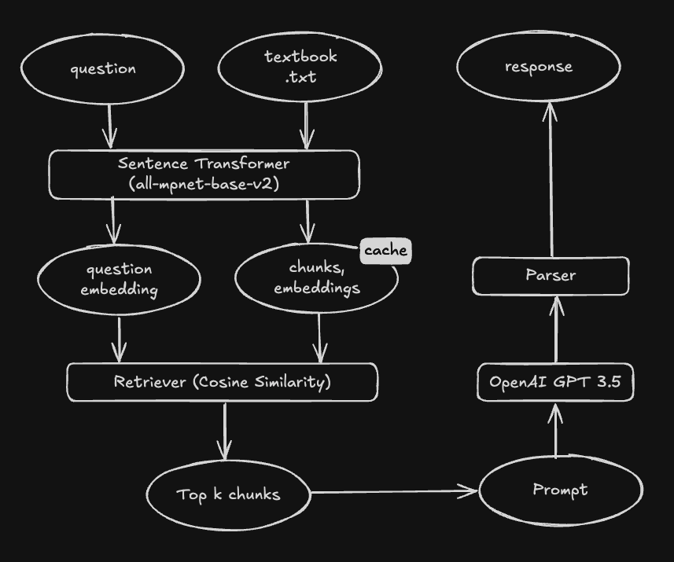

# RAG MCQ Agent

A Retrieval-Augmented Generation (RAG) system for answering multiple-choice questions using context from a reference textbook. The agent combines semantic search with large language models to provide accurate answers to medical and scientific questions.



## Architecture

The agent follows a multi-stage pipeline:

1. **Input Validation**: Validates question and answer choices format
2. **RAG Retrieval**: 
   - Loads and processes textbook from file (normalizes whitespace, preserves structure)
   - Chunks text into structured segments with metadata (text, start_char, end_char, chunk_index)
   - Calculates SHA256 hash to verify textbook integrity
   - Preprocesses and generates embeddings for semantic search
   - Retrieves top-k most relevant chunks for the query
3. **Prompt Construction**: Builds comprehensive prompt with:
   - Retrieved context chunks
   - Few-shot examples
   - Chain-of-thought reasoning instructions
4. **LLM Inference**: Calls OpenAI API (GPT-3.5-turbo) to generate response
5. **Answer Extraction**: Multi-strategy parsing:
   - Chain-of-thought pattern matching (looks for "Therefore", "Answer:", etc.)
   - Letter extraction using regex (case-insensitive)
   - Number extraction (0-3)
   - Fuzzy matching for substrings matching answer choices

## Evaluation

The evaluation system is handled by [testbench.py](testbench.py), which reads questions, answer choices, and correct answers from [testbench.csv](data/testbench.csv). For each question, the agent predicts an answer by selecting from the provided options. The agent's response is compared to the correct choice, and a point is awarded for each correct match. The final score reflects the number of correct predictions out of the total number of questions.


## Quick Start

### Using Docker

1. **Create `.env` file**:
   ```bash
   echo "OPENAI_API_KEY=your-api-key-here" > .env
   ```

2. **Start the application**:
   ```bash
   docker compose up --build
   ```

3. **Access the web interface**:
   Open `http://localhost:8501` in your browser

### Using Python

1. **Install dependencies**:
   ```bash
   pip install -r requirements.txt
   ```

2. **Set up API key and database**:
   ```bash
   echo "OPENAI_API_KEY=your-api-key-here" > .env
   ```
   
3. **Run the web interface**:
   ```bash
   streamlit run app.py
   ```

## Requirements

- **Python**: 3.10 or higher (or Docker)
- **OpenAI API Key**: Required for LLM inference
- **PostgreSQL**: Optional for local development (included in Docker Compose)
- **Dependencies**: See `requirements.txt` for full list

## Usage

### Web Interface

The Streamlit web interface (`app.py`) provides a user-friendly way to interact with the agent:

- **CSV Upload**: Upload your own CSV file with MCQ questions for evaluation
- **Default Testbench**: Quick start with pre-loaded test questions from `data/testbench.csv`
- **Real-time Processing**: Progress tracking during evaluation with live updates
- **Results Dashboard**: Comprehensive metrics, filtering, and detailed question-by-question analysis
- **Export Results**: Download evaluation results as CSV for further analysis

**CSV Format** (required columns):
```csv
id,question,answer_0,answer_1,answer_2,answer_3,correct
1,"What is a GMO?","A genetically modified organism","A type of protein","A DNA sequence","None of the above","A genetically modified organism"
```

- `id`: Unique question identifier
- `question`: The question text
- `answer_0` through `answer_3`: Four answer choices
- `correct`: The correct answer (must match one of the answer choices exactly)

### Command Line Testing

**Run testbench** (basic evaluation):
```bash
python testbench.py
```


### Programmatic Usage

```python
from hip_agent import HIPAgent

agent = HIPAgent()
question = "What is a GMO?"
answer_choices = [
    "A genetically modified organism",
    "A type of protein",
    "A DNA sequence",
    "None of the above"
]
response_index = agent.get_response(question, answer_choices)
print(f"Answer index: {response_index}")
```

## Docker Deployment

### Docker Compose

```bash
# Build and start
docker compose up --build

# Run in background
docker compose up -d --build

# View logs
docker compose logs -f

# Stop
docker compose down
```

### Docker CLI

```bash
# Build image
docker build -t rag-mcq-agent .

# Run container
docker run -d \
  --name rag-mcq-agent \
  -p 8501:8501 \
  --env-file .env \
  rag-mcq-agent

# View logs
docker logs -f rag-mcq-agent

# Stop and remove
docker stop rag-mcq-agent && docker rm rag-mcq-agent
```

### Docker Configuration

- **Port**: 8501 (Streamlit default)
- **Health Check**: Automatic monitoring every 30 seconds
- **Environment Variables**: `OPENAI_API_KEY` required (via `.env` file)
- **Image Size**: ~150MB
## How It Works

The agent processes questions through the following workflow:

1. **Question Processing**: Receives question and answer choices, validates input format
2. **RAG Retrieval**: Retrieves relevant context from textbook using semantic embeddings
3. **Prompt Construction**: Builds comprehensive prompt with context, few-shot examples, and chain-of-thought reasoning instructions
4. **API Call**: Sends prompt to GPT-3.5-turbo via OpenAI API
5. **Answer Extraction**: Uses multiple parsing strategies (regex, fuzzy matching, pattern recognition)
6. **Response**: Returns answer index (0-3) corresponding to the selected choice, or -1 if no valid match is found

## Project Structure

```
rag-mcq-agent/
├── agent/                    # Core agent implementation
│   ├── __init__.py
│   ├── config.py            # Configuration constants
│   ├── retriever.py         # RAG retrieval logic
│   ├── prompts.py           # Prompt construction
│   ├── textbook_processor.py # Textbook processing and chunking
│   └── utils/               # Utility modules
│       ├── answer_parser.py # Answer extraction logic
│       ├── api_client.py    # OpenAI API client
│       └── validators.py    # Input validation
├── data/                    # Test data and textbook
│   ├── testbench.csv        # Sample questions
│   └── textbook.txt         # Reference textbook
├── tests/                   # Test scripts
│   └── run_tests_with_stats.py  # Statistical test runner
├── scripts/                 # Utility scripts
│   └── generate_questions.py
├── docs/                    # Documentation
├── app.py                   # Streamlit web interface
├── testbench.py             # Evaluation script
├── hip_agent.py             # Main agent class
├── Dockerfile               # Docker configuration
├── docker-compose.yml       # Docker Compose configuration
└── requirements.txt         # Python dependencies
```
