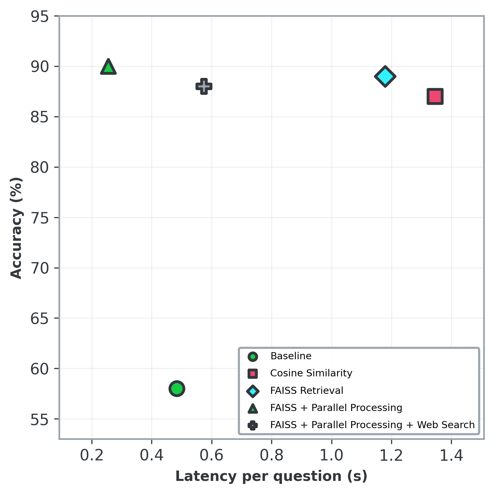

<div align="center">

# RAG MCQ Agent

[](https://github.com/nee1k/rag-mcq-agent/actions/workflows/ci.yml)

A Retrieval-Augmented Generation (RAG) system for answering biomedical and life science multiple-choice questions using context from a reference textbook.

</div>

## Quick Start

**Set up API keys**:
   ```bash
   echo "OPENAI_API_KEY=your-api-key-here" > .env
   # Optional: Enable web search (requires Tavily API key)
   echo "TAVILY_API_KEY=your-tavily-key-here" >> .env
   echo "WEB_SEARCH_ENABLED=true" >> .env
   ```

### Using Docker
   ```bash
   docker compose up --build
   ```

### Using Python
   ```bash
   pip install -r requirements.txt
   streamlit run app.py
   ```
   
   Open `http://localhost:8501` in your browser to access the web interface.

## How It Works

<div align="center">

</div>

The agent follows a multi-stage pipeline:

1. **Question Processing**: Receives query and answer choices, generates a query embedding
2. **RAG Retrieval**: 
   - Chunks textbook into segments with metadata (text, start_char, end_char, chunk_index)
   - Generates embeddings (a 768-dimensional dense vector space) using [sentence transformer](https://huggingface.co/sentence-transformers/all-mpnet-base-v2)
   - Caches embeddings into a [.npz file](https://numpy.org/devdocs/reference/generated/numpy.savez.html) with a SHA-256 hash 
   - Retrieves top-k most relevant chunks for the query embedding using [FAISS](https://github.com/facebookresearch/faiss)

3. **Web Search**: If enabled, performs web search using [Tavily API](https://tavily.com) to retrieve current information and complement textbook context

4. **Prompt Construction**: Builds the prompt with retrieved textbook chunks, web search results, [few-shot examples](agent/prompts.yaml), and chain-of-thought reasoning instructions
```
[System Role]
[Textbook Context Section]
[Web Search Results Section]
[Few-shot Examples]
Now answer this NEW question:
[Question]
[Answer Choices]
[Instructions]
[Response Format]
```

5. **LLM Inference**: Calls the OpenAI API (GPT-3.5-turbo) to generate a response

6. **Answer Extraction**: Uses multiple parsing strategies (regex, fuzzy matching, pattern recognition)

7. **Response**: Returns answer index (0-3) corresponding to the selected choice, or -1 if no valid match is found

## Evaluation

The evaluation is handled by [testbench.py](testbench.py), which reads questions, answer choices, and correct answers from [testbench.csv](testbench.csv). For each question, the agent predicts an answer by selecting from the provided options. The agent's response is compared to the correct choice, and a point is awarded for each correct match. The final score reflects the number of correct predictions out of the total number of questions.

## Performance

The agent has been optimized with several performance improvements including FAISS vector search, parallel API processing, and binary cache formats. 

All evaluations were conducted using a synthetic workload of [100 MCQs](tests/extended_testbench.csv) generated using [a python script](scripts/generate_questions.py). The testing was performed in a virtual machine with 8 vCPUs, 30 GB of RAM, and 60 GB of local storage.

<div align="center">

</div>

Accuracy increased from 58% to 89%, while latency was reduced by half and throughput almost doubled. All benchmarks were performed with textbook embeddings pre-cached.

## Usage

### Web Interface

The Streamlit web interface (`app.py`) provides a user-friendly way to interact with the agent:

- **CSV Upload**: Upload your own CSV file with MCQ questions for evaluation
- **Default Testbench**: Quick start with pre-loaded test questions from `data/testbench.csv`
- **Real-time Processing**: Progress tracking during evaluation with live updates
- **Results Dashboard**: Comprehensive metrics, filtering, and detailed question-by-question analysis
- **Export Results**: Download evaluation results as CSV for further analysis

**CSV Format** (required columns):
```csv
id,question,answer_0,answer_1,answer_2,answer_3,correct
1,"What is a GMO?","A genetically modified organism","A type of protein","A DNA sequence","None of the above","A genetically modified organism"
```

- `id`: Unique question identifier
- `question`: The question text
- `answer_0` through `answer_3`: Four answer choices
- `correct`: The correct answer (must match one of the answer choices exactly)

### Command Line Testing

**Run testbench** (basic evaluation):
```bash
python testbench.py
```

### Programmatic Usage

```python
from hip_agent import HIPAgent

agent = HIPAgent()
question = "What is a GMO?"
answer_choices = [
    "A genetically modified organism",
    "A type of protein",
    "A DNA sequence",
    "None of the above"
]
response_index = agent.get_response(question, answer_choices)
print(f"Answer index: {response_index}")
```

## Docker Deployment

### Docker Compose

```bash
# Build and start
docker compose up --build

# Run in background
docker compose up -d --build

# View logs
docker compose logs -f

# Stop
docker compose down
```

### Docker CLI

```bash
# Build image
docker build -t rag-mcq-agent .

# Run container
docker run -d \
  --name rag-mcq-agent \
  -p 8501:8501 \
  --env-file .env \
  rag-mcq-agent

# View logs
docker logs -f rag-mcq-agent

# Stop and remove
docker stop rag-mcq-agent && docker rm rag-mcq-agent
```

### Docker Configuration

- **Port**: 8501 (Streamlit default)
- **Health Check**: Automatic monitoring every 30 seconds
- **Environment Variables**: 
  - `OPENAI_API_KEY` required (via `.env` file)
  - `TAVILY_API_KEY` optional (for web search feature)
  - `WEB_SEARCH_ENABLED` optional (set to `true` to enable web search)
- **Image Size**: ~150MB

## Web Search Feature

The agent supports optional web search integration to complement textbook RAG retrieval with up-to-date information from the web.

### Setup

1. **Get Tavily API Key**: Sign up at [https://tavily.com](https://tavily.com) (free tier available)

2. **Configure Environment Variables**:
   ```bash
   echo "TAVILY_API_KEY=your-tavily-key-here" >> .env
   echo "WEB_SEARCH_ENABLED=true" >> .env
   ```

3. **Optional Configuration**:
   - `WEB_SEARCH_PROVIDER`: Search provider (default: `"tavily"`)
   - `WEB_SEARCH_MAX_RESULTS`: Maximum web results to retrieve (default: `3`)
   - `WEB_SEARCH_MIN_RELEVANCE`: Minimum relevance score threshold (default: `0.5`)
